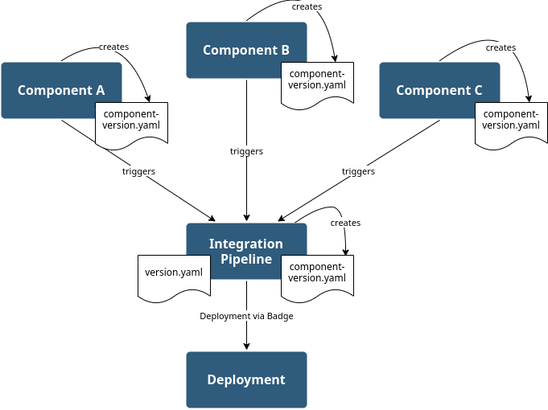
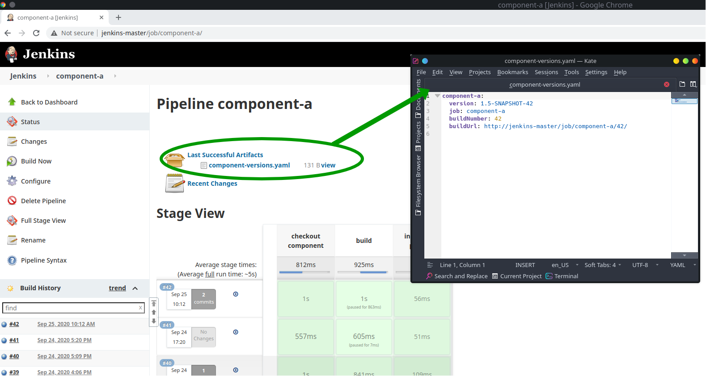
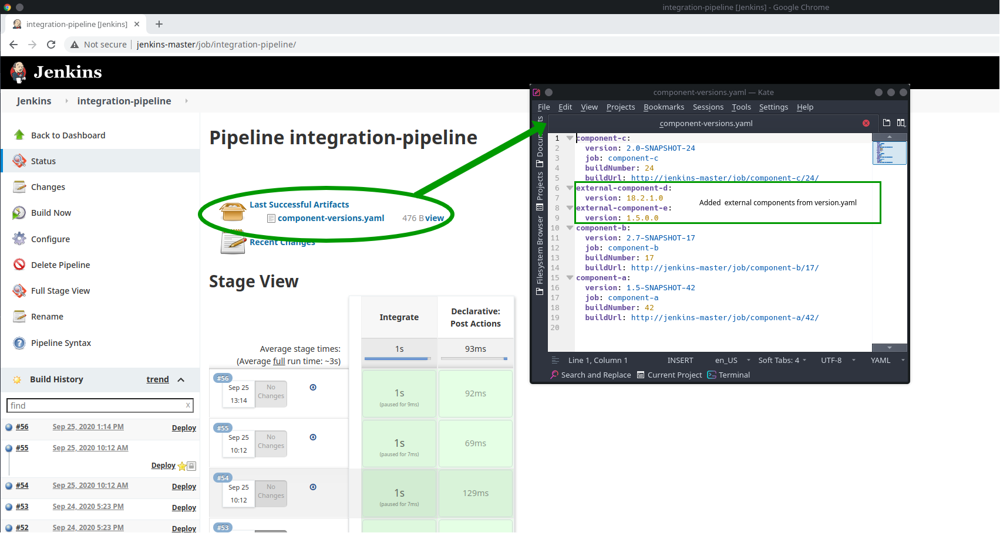
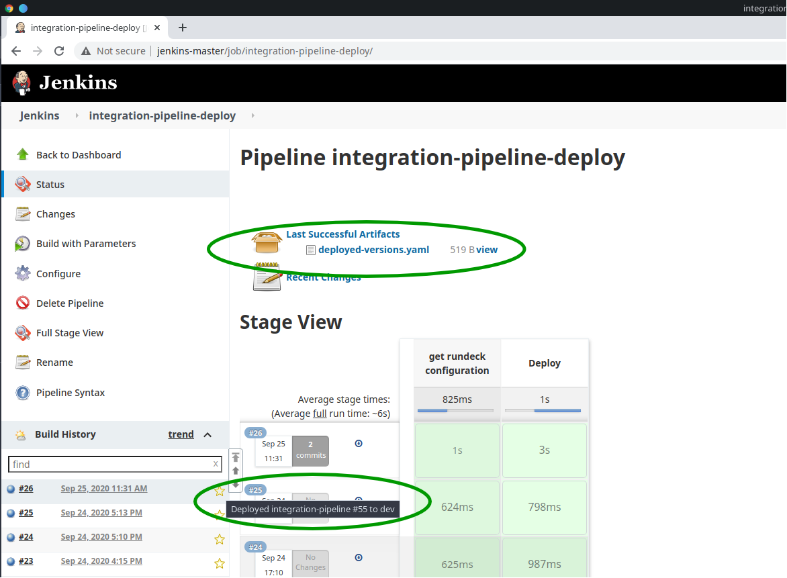
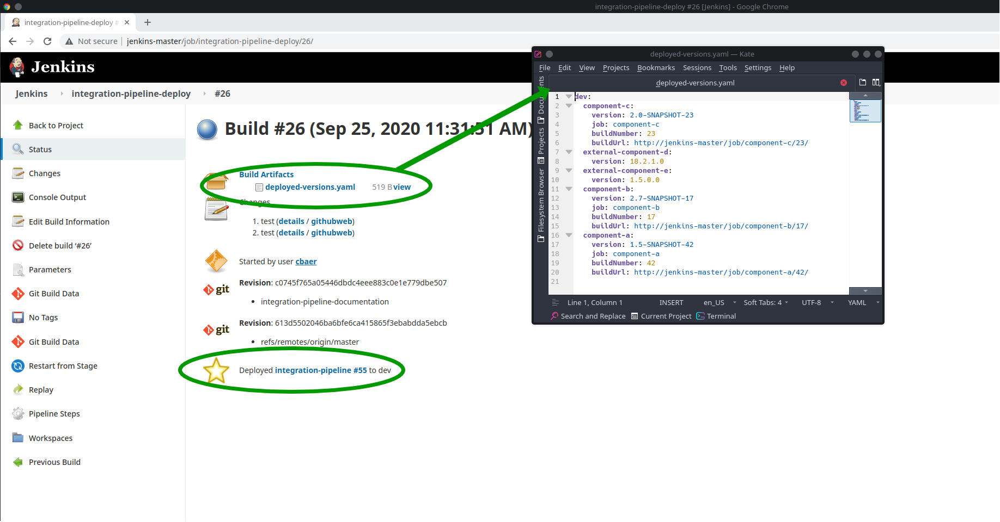

# Integration Pipeline

## Idea

The integration pipeline is part of the development process. It contains several functions which provide help with promotions and deployment.
The following image sketches how the pipeline is interacting with the rest of the build process.
Every component triggers the function `trackComponentVersions`. The function gathers the data of the build and stores this in the file `component-versions.yaml`, which is archived for every build.

When the build job was successfully finished, it automatically triggers the integration pipeline job.
This job also contains the function `trackComponentVersions`. The result of the function also creates a `component-version.yaml`. But in contrast to the build job, the integration pipeline aggregates the information from the upstream build that it was triggered by and updates only the changed component and the `component-version.yaml` from the last successful integration pipeline build.
Additionally, the integration pipeline needs its own `version.yaml` (in the repository). This can be empty or it may contain external components which are necessary for deployment. This information will be added to the `component-version.yaml`.

Once the integration pipeline has successfully gathered all information, a `Deploy` badge will be applied to the job overview.
This is done by the function `addDeployLinks`. This link triggers the deployment pipeline with the information of the integration pipeline (e.g. job-name and build-number).
This procedure ensures that only the component versions stored in the `component-versions.yaml` are deployed when triggering the deployment pipeline.

Once the `Deploy` badge is activated, the deployment pipeline is triggered.
This pipeline contains the function `deployChangedComponents`.

----
**NOTE**

The function has yet only generic content.
Right now it just maps a rundeck file, which defines the jobs that need to be run for deployment.
To use the full functionality, it has to be refactored.

----

Once the Deployment is done, the job in the deployment pipeline is marked with a star for the deployment on the specific environment.

You will find additional information on the detail page of the deployment pipeline:

* `deployed-components.yaml` will show you which components have been installed
* a badge with the information which integration pipeline triggered the installation

Futhermore, the badge is also applied in the integration pipeline job that triggered the deployment.

## needed plugins

* Pipeline Maven Integration
* Copy Artifact
* Pipeline Utility Steps
* Badge
* promoted builds
* Build With Parameters
